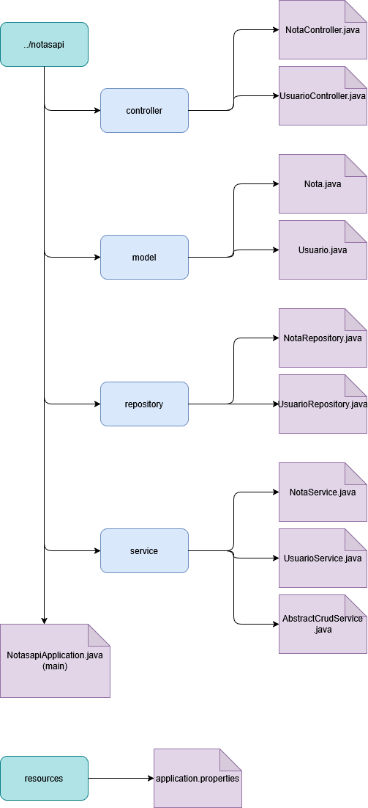
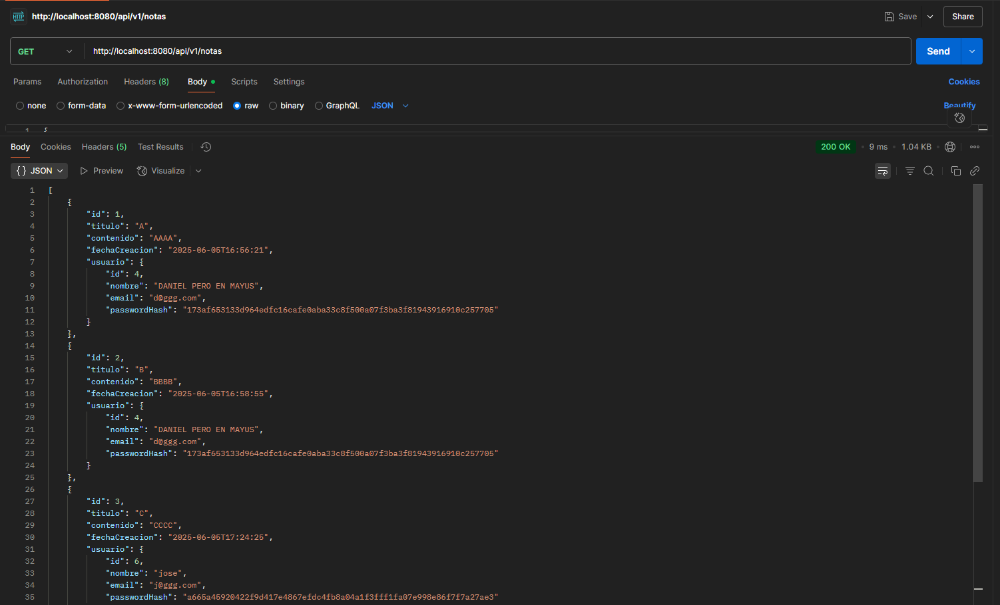

# Actividad-Final-Integrada-UT6-y-UT7
API REST en Java + Spring Boot que permite gestionar Usuarios y sus Notas de forma persistente, usando JPA.

## Estructura del proyecto
La aplicación se encuentra dentro de 

## biblioteca/src/main/java/com/tuapp/notasapi

Dentro están los siguientes paquetes:

# Controller
Paquete que contiene las clases NotaController.java y UsuarioController.java
# Model
Paquete que con los datos de las entidades Nota y Usuario. Contiene Nota.java y Usuario.java
# Repository
Interfaz para acceder a la base de datos. Contiene NotaRepository.java y UsuarioRepository.java
# Service
Capa intermedia entre la API y los datos. Contiene NotaService.java y UsuarioService.java

## Requisitos de uso

 - Visual Studio Code + Extensiones de Sprinboot
 - Spring Boot con dependencias Spring Web, Spring Data JPA Y MySQL Driver
 - Java 17+

## Endpoints implementados

 ### UsuarioController (/api/v1/usuarios, /api/v2/usuarios)

  #### GET /usuarios
  Se obtienen todos los usuarios del sistema  
  

  #### GET /usuarios/{id}
  Se busca a un usuario concreto por su id
  

  #### POST /usuarios
  Crear un usuario nuevo
  

  #### PUT /usuarios/{id}
  Se actualiza alguno de los datos de un usuario del que se espicifica su id
   

  #### DELETE /usuarios/{id}
  Buscamos el usuario a borrar (en este caso el 5)
  
  Borramos al usuario con el endpoint
  
  Lo buscamos de nuevo y obtenemos el error personalizado
  

 <strong>Nota: el endpoint /api/v2/usuarios nos parecío rebundante ya que en el v1 ya guardas el usuario/contraseña por lo que desde el mismo modelo, se hashea la contraseña y se guarda todo a la vez </strong> 

 ### NotaController (/api/v1/notas)  
   #### GET /notas
   Se obtenienen todas las notas del sistema
  

   #### GET /notas?usuarioId={id}&order={asc|desc}
   Caso 1: obtener todas las notas del usuario 4 en orden ascendente
   
   Caso 2: obtener todas las notas del usuario 6 en orden descendente
   

   #### GET /notas/{id}
   Obtener una nota concreta por su ID
   

   #### POST /notas
   Crear una nueva nota
   
   

   #### PUT /notas/{id}
   Cambiar el valor de un campo de la nota
   

   #### DELETE /notas/{id}
   Decidimos que nota vamos a eliminar (en este caso la 3) 
  
   Enviamos la petición
  
   Buscamos esa nota y obtenemos el mensaje personalizado de error
  

## Autores

 - Daniel Ramos Montoya
 - José Antonio Alonso Navarro

